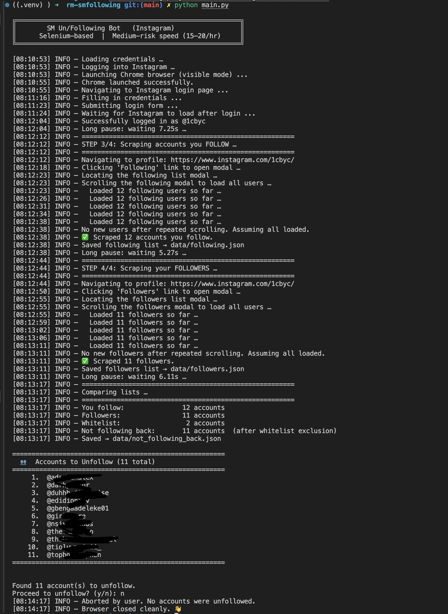

# SM Following Bot

**Selenium-based** Instagram bot that identifies and unfollows accounts that don't follow you back — mimicking human behavior to avoid detection.

> **Safety Notice**: This bot is for educational and personal use only. Use responsibly and within Instagram's terms of service. Excessive automation can result in account restrictions.

---

## Project Structure

```
rm-smfollowing/
├── src/
│   ├── __init__.py
│   ├── ig_login.py        ← Login module (Selenium + human typing)
│   ├── get_following.py   ← Scrape your following list
│   ├── get_followers.py   ← Scrape your followers list
│   ├── compare.py         ← Find non-followers
│   ├── unfollow.py        ← Unfollow engine with auto-pause
│   └── helpers.py         ← Shared utilities (delays, scrolling, rate-limit)
├── drivers/
│   ├── chromedriver_mac      ← macOS ChromeDriver binary
│   └── chromedriver_win.exe  ← Windows ChromeDriver binary
├── data/
│   ├── followers.json         ← Auto-generated after scrape
│   ├── following.json         ← Auto-generated after scrape
│   └── not_following_back.json← Auto-generated after compare
├── config/
│   ├── credentials.json  ← Your Instagram credentials
│   └── whitelist.json    ← Accounts to never unfollow
├── main.py               ← Entry point
├── requirements.txt
└── README.md
```

---

## Installation & Setup

### 1. Prerequisites

- **Python 3.9+**
- **Google Chrome** browser installed
- **ChromeDriver** matching your Chrome version

### 2. Install Python dependencies

```bash
cd rm-smfollowing
pip3 install -r requirements.txt
```

### 3. Set up ChromeDriver

#### macOS:
1. Download the ChromeDriver matching your Chrome version from [chromedriver.chromium.org](https://chromedriver.chromium.org/downloads)
2. OR install via Homebrew:
   ```bash
   brew install --cask chromedriver
   # Then allow it in System Preferences > Security & Privacy
   xattr -d com.apple.quarantine drivers/chromedriver_mac
   chmod +x drivers/chromedriver_mac
   ```
3. Place the binary at `drivers/chromedriver_mac`

#### Windows:
1. Download ChromeDriver from [chromedriver.chromium.org](https://chromedriver.chromium.org/downloads)
2. Place the `.exe` at `drivers/chromedriver_win.exe`

> **Tip**: The bot also supports Selenium Manager auto-detection — if your chromedriver isn't in the `drivers/` folder, it will try to auto-download the correct version.

### 4. Set credentials

Edit `config/credentials.json`:
```json
{
  "username": "your_instagram_username",
  "password": "your_instagram_password"
}
```

You can `cp config/credentials-example.json config/credentials.json` to fix your account credentials.

> Never commit this file to version control. It's already in `.gitignore`.

### 5. Set your whitelist (optional)

Edit `config/whitelist.json` to add usernames you **never** want to unfollow:
```json
{
  "whitelist": [
    "close_friend",
    "business_partner",
    "celebrity_you_follow"
  ]
}
```

---

## Running the Bot

### Normal run (full pipeline):
```bash
python3 main.py
```

### Dry run (preview only, no unfollowing):
```bash
python3 main.py --dry-run
```

### Skip scraping (use previously saved data):
```bash
python3 main.py --skip-scrape
```

---

## How It Works

```
Login → Scrape Following → Scrape Followers → Compare → Preview → Confirm → Unfollow
```

1. **Login**: Opens Chrome, navigates to Instagram, types credentials human-like
2. **Scrape Following**: Opens your following modal, scrolls to load all users
3. **Scrape Followers**: Opens your followers modal, scrolls to load all users
4. **Compare**: `following - followers - whitelist = to_unfollow`
5. **Preview**: Shows a table of accounts to unfollow before acting
6. **Confirm**: Asks `Proceed to unfollow? (y/n)`
7. **Unfollow**: Visits each profile, clicks "Following" → "Unfollow"

---

## Safety Features

### Human-Like Behavior
| Feature | Value |
|---|---|
| Random delays between actions | 1.5s – 4.8s |
| Random scroll distances | 300 – 800px |
| Character-by-character typing | 50 – 200ms / char |
| Mouse movement simulation | ±5px random offset |
| Delay between unfollows | 170 – 240 seconds |

### Medium-Risk Speed
The bot stops at **20 unfollows per hour** and waits for the hour window to reset before continuing. This is the safest speed setting for avoiding action blocks.

To change the speed, edit in `src/unfollow.py`:
```python
MAX_UNFOLLOWS_PER_HOUR = 20   # Decrease for safer, increase for faster
```

| Speed | Unfollows/hr | Risk Level |
|---|---|---|
| Conservative | 10 | Very Low |
| **Medium (default)** | **20** | **Low** |
| Aggressive | 40 | Medium-High |
| Dangerous | 60+ | Very High |

### Auto-Pause on Rate Limits
The bot continuously monitors the page for these Instagram phrases:
- "Try Again Later"
- "Action Blocked"
- "Please Wait"
- "Protecting our community"
- "We restrict certain activity"
- "Please Slow Down"

**When detected**:
1. Immediately stops unfollowing
2. Prints: `Instagram rate limit detected — auto-pausing`
3. Randomly waits **10–20 minutes**
4. Automatically resumes from where it stopped

---

## See Output




---

## Do this (if you use macos)

```bash
### Download (replace 114.0.5735.90 with your exact version)
curl -O https://chromedriver.storage.googleapis.com/114.0.5735.90/chromedriver_mac64.zip
unzip chromedriver_mac64.zip
mv chromedriver drivers/chromedriver_mac

#### Allow macOS to run it
chmod +x drivers/chromedriver_mac
xattr -d com.apple.quarantine drivers/chromedriver_mac
```

---

## Module Reference

| File | Purpose |
|---|---|
| `src/helpers.py` | Shared utilities: delays, scrolling, rate-limit detection |
| `src/ig_login.py` | Chrome setup, anti-bot flags, login flow, 2FA pause |
| `src/get_following.py` | Scrape all accounts you follow |
| `src/get_followers.py` | Scrape all your followers |
| `src/compare.py` | Set difference + whitelist filtering + preview |
| `src/unfollow.py` | Profile visit, button clicking, session management |
| `main.py` | Orchestration entry point |

---

## 2FA / Verification Handling

If Instagram asks for 2FA or a security check during login:
1. The bot will **pause** and display a message
2. Complete the verification on your phone
3. Press **Enter** in the terminal to continue

---

## Data Files

| File | Contents |
|---|---|
| `data/following.json` | List of usernames you follow |
| `data/followers.json` | List of your followers |
| `data/not_following_back.json` | Computed unfollow targets |

These are regenerated each run (unless `--skip-scrape` is used).

---

## Troubleshooting

**Chrome version mismatch**  
→ Download the matching ChromeDriver from [chromedriver.chromium.org](https://chromedriver.chromium.org/downloads)

**"Action Blocked" immediately**  
→ Use the script less frequently. Wait 24–48 hours before trying again.

**Login fails with challenge**  
→ Complete the security check on your phone app, then re-run.

**Modal doesn't open**  
→ Instagram may have changed their UI. Check the console for XPath errors and update selectors in `get_following.py` / `get_followers.py`.

---

## ⚖️ Legal Disclaimer

This tool is for **personal, educational use only**. The author is not responsible for any account restrictions, bans, or other consequences. Instagram's Terms of Service prohibit automated interactions — use at your own risk.